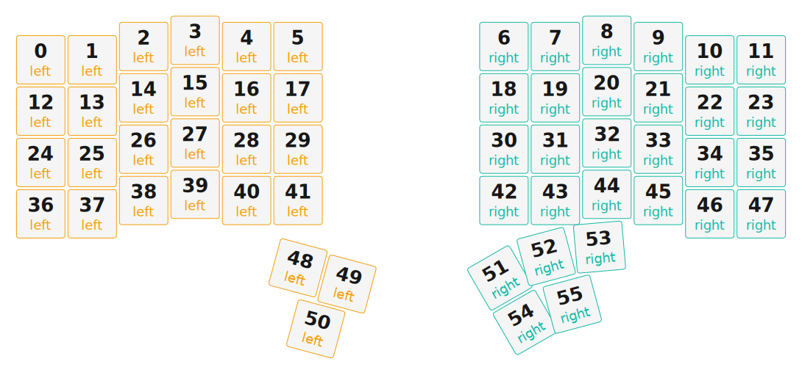

# ZMK Configuration for charybdis

*Generated by Shield Wizard for ZMK*



Download compiled firmware from the Actions tab. <https://zmk.dev/docs/user-setup#installing-the-firmware>

Edit your keymap <https://zmk.dev/docs/keymaps>.
User keymap is located at [`config/spc_charybdis.keymap`](config/spc_charybdis.keymap).

-----

<details>
<summary>
Shield Wizard Debug Information
</summary>

In case of broken configuration, here is the Shield Wizard internal data used to generate this configuration:

Commit: 63ab9b7bd8845252979f45da72f40210b0b1a3ae

```json
{"name":"charybdis","shield":"spc_charybdis","dongle":false,"modules":["badjeff/pmw3610"],"layout":[{"id":"01KTV1N8BMY0C73EVCMN7RX2SK","w":1,"h":1,"x":0,"y":0.38,"r":0,"rx":0,"ry":0,"part":0,"row":0,"col":0},{"id":"01KTV1N8BM17HCBBEY0RC4S852","w":1,"h":1,"x":1,"y":0.38,"r":0,"rx":0,"ry":0,"part":0,"row":0,"col":1},{"id":"01KTV1N8BMR6RYPSND255M6684","w":1,"h":1,"x":2,"y":0.12,"r":0,"rx":0,"ry":0,"part":0,"row":0,"col":2},{"id":"01KTV1N8BMASCQ40W8R0XX7KJA","w":1,"h":1,"x":3,"y":0,"r":0,"rx":0,"ry":0,"part":0,"row":0,"col":3},{"id":"01KTV1N8BMJTBKRBNCH7HG1DWX","w":1,"h":1,"x":4,"y":0.12,"r":0,"rx":0,"ry":0,"part":0,"row":0,"col":4},{"id":"01KTV1N8BM75EAV195WWHGRJYP","w":1,"h":1,"x":5,"y":0.12,"r":0,"rx":0,"ry":0,"part":0,"row":0,"col":5},{"id":"01KTV1N8BMD3SN99D5E1PMF7TJ","w":1,"h":1,"x":9,"y":0.12,"r":0,"rx":0,"ry":0,"part":1,"row":0,"col":6},{"id":"01KTV1N8BMSC08QE4TVGYM7KGF","w":1,"h":1,"x":10,"y":0.12,"r":0,"rx":0,"ry":0,"part":1,"row":0,"col":7},{"id":"01KTV1N8BM09KH63B63JYRVR05","w":1,"h":1,"x":11,"y":0,"r":0,"rx":0,"ry":0,"part":1,"row":0,"col":8},{"id":"01KTV1N8BMJF7KSKHVTYYYKH7R","w":1,"h":1,"x":12,"y":0.12,"r":0,"rx":0,"ry":0,"part":1,"row":0,"col":9},{"id":"01KTV1N8BMV2J5ET6R75DRSV3E","w":1,"h":1,"x":13,"y":0.38,"r":0,"rx":0,"ry":0,"part":1,"row":0,"col":10},{"id":"01KTV1N8BM9FA8PX3088KEGM6Y","w":1,"h":1,"x":14,"y":0.38,"r":0,"rx":0,"ry":0,"part":1,"row":0,"col":11},{"id":"01KTV1N8BM7D25Y5WPA38GXA4F","w":1,"h":1,"x":0,"y":1.38,"r":0,"rx":0,"ry":0,"part":0,"row":1,"col":0},{"id":"01KTV1N8BMCSSXWZXH33GS67CX","w":1,"h":1,"x":1,"y":1.38,"r":0,"rx":0,"ry":0,"part":0,"row":1,"col":1},{"id":"01KTV1N8BMTRW1D2XQKJRRDG8R","w":1,"h":1,"x":2,"y":1.12,"r":0,"rx":0,"ry":0,"part":0,"row":1,"col":2},{"id":"01KTV1N8BMH6THMSYXRKRZ18DK","w":1,"h":1,"x":3,"y":1,"r":0,"rx":0,"ry":0,"part":0,"row":1,"col":3},{"id":"01KTV1N8BM4GYS5144R9VPVJMY","w":1,"h":1,"x":4,"y":1.12,"r":0,"rx":0,"ry":0,"part":0,"row":1,"col":4},{"id":"01KTV1N8BMKCVC8534EDYK8PRM","w":1,"h":1,"x":5,"y":1.12,"r":0,"rx":0,"ry":0,"part":0,"row":1,"col":5},{"id":"01KTV1N8BM1NZVXP91XVSHE0TT","w":1,"h":1,"x":9,"y":1.12,"r":0,"rx":0,"ry":0,"part":1,"row":1,"col":6},{"id":"01KTV1N8BMFJCWNRXDZXX5JQD1","w":1,"h":1,"x":10,"y":1.12,"r":0,"rx":0,"ry":0,"part":1,"row":1,"col":7},{"id":"01KTV1N8BMV7FJ3BPTAFH6925X","w":1,"h":1,"x":11,"y":1,"r":0,"rx":0,"ry":0,"part":1,"row":1,"col":8},{"id":"01KTV1N8BM2HB8GM77C32QFW7Z","w":1,"h":1,"x":12,"y":1.12,"r":0,"rx":0,"ry":0,"part":1,"row":1,"col":9},{"id":"01KTV1N8BMW310F8MEM5N0H0NP","w":1,"h":1,"x":13,"y":1.38,"r":0,"rx":0,"ry":0,"part":1,"row":1,"col":10},{"id":"01KTV1N8BMFJ61AY3XYAJ32ZPH","w":1,"h":1,"x":14,"y":1.38,"r":0,"rx":0,"ry":0,"part":1,"row":1,"col":11},{"id":"01KTV1N8BM6CTKY7C4YQQ4SEVQ","w":1,"h":1,"x":0,"y":2.38,"r":0,"rx":0,"ry":0,"part":0,"row":2,"col":0},{"id":"01KTV1N8BMEMDB54PBD17BGWK6","w":1,"h":1,"x":1,"y":2.38,"r":0,"rx":0,"ry":0,"part":0,"row":2,"col":1},{"id":"01KTV1N8BM174FHQNS4G4TDSBY","w":1,"h":1,"x":2,"y":2.12,"r":0,"rx":0,"ry":0,"part":0,"row":2,"col":2},{"id":"01KTV1N8BMH917VP0XTT86KE8S","w":1,"h":1,"x":3,"y":2,"r":0,"rx":0,"ry":0,"part":0,"row":2,"col":3},{"id":"01KTV1N8BMWS9F8DSG46FX02QB","w":1,"h":1,"x":4,"y":2.12,"r":0,"rx":0,"ry":0,"part":0,"row":2,"col":4},{"id":"01KTV1N8BM4227XGGZZXKATXWZ","w":1,"h":1,"x":5,"y":2.12,"r":0,"rx":0,"ry":0,"part":0,"row":2,"col":5},{"id":"01KTV1N8BMQ5R2P4DGP9PXSAM1","w":1,"h":1,"x":9,"y":2.12,"r":0,"rx":0,"ry":0,"part":1,"row":2,"col":6},{"id":"01KTV1N8BM3M2DNFBAT98PY86D","w":1,"h":1,"x":10,"y":2.12,"r":0,"rx":0,"ry":0,"part":1,"row":2,"col":7},{"id":"01KTV1N8BMZTMNA3VJ13NSVB5C","w":1,"h":1,"x":11,"y":2,"r":0,"rx":0,"ry":0,"part":1,"row":2,"col":8},{"id":"01KTV1N8BMX5NTTF78EGH7BGFF","w":1,"h":1,"x":12,"y":2.12,"r":0,"rx":0,"ry":0,"part":1,"row":2,"col":9},{"id":"01KTV1N8BMXQ6S316YPNKVZN5D","w":1,"h":1,"x":13,"y":2.38,"r":0,"rx":0,"ry":0,"part":1,"row":2,"col":10},{"id":"01KTV1N8BMBZMRAMVKERN6Y2VC","w":1,"h":1,"x":14,"y":2.38,"r":0,"rx":0,"ry":0,"part":1,"row":2,"col":11},{"id":"01KTV1N8BMS9KEZ9TWEY1K2QP4","w":1,"h":1,"x":0,"y":3.38,"r":0,"rx":0,"ry":0,"part":0,"row":3,"col":0},{"id":"01KTV1N8BMRG65A09VY711NPJP","w":1,"h":1,"x":1,"y":3.38,"r":0,"rx":0,"ry":0,"part":0,"row":3,"col":1},{"id":"01KTV1N8BMWF0Q01CMD20D43TP","w":1,"h":1,"x":2,"y":3.12,"r":0,"rx":0,"ry":0,"part":0,"row":3,"col":2},{"id":"01KTV1N8BMFXJ8D1WRQ1F5S5J4","w":1,"h":1,"x":3,"y":3,"r":0,"rx":0,"ry":0,"part":0,"row":3,"col":3},{"id":"01KTV1N8BMMYW4PC8Y5E4P4P6D","w":1,"h":1,"x":4,"y":3.12,"r":0,"rx":0,"ry":0,"part":0,"row":3,"col":4},{"id":"01KTV1N8BM3P8S5MWHB0NV91ZV","w":1,"h":1,"x":5,"y":3.12,"r":0,"rx":0,"ry":0,"part":0,"row":3,"col":5},{"id":"01KTV1N8BMGXWP7W2263H9JNHX","w":1,"h":1,"x":9,"y":3.12,"r":0,"rx":0,"ry":0,"part":1,"row":3,"col":6},{"id":"01KTV1N8BM7NVC1EH8YHXRHJ7P","w":1,"h":1,"x":10,"y":3.12,"r":0,"rx":0,"ry":0,"part":1,"row":3,"col":7},{"id":"01KTV1N8BM3H5GEVYKNRG42C4J","w":1,"h":1,"x":11,"y":3,"r":0,"rx":0,"ry":0,"part":1,"row":3,"col":8},{"id":"01KTV1N8BMYW5FYB3WNYZSC2MR","w":1,"h":1,"x":12,"y":3.12,"r":0,"rx":0,"ry":0,"part":1,"row":3,"col":9},{"id":"01KTV1N8BMKPVC9XRP34AMYGZY","w":1,"h":1,"x":13,"y":3.38,"r":0,"rx":0,"ry":0,"part":1,"row":3,"col":10},{"id":"01KTV1N8BM6PPYFTJMW383NSGD","w":1,"h":1,"x":14,"y":3.38,"r":0,"rx":0,"ry":0,"part":1,"row":3,"col":11},{"id":"01KTV1N8BMMN5QMHAFM0HNMK2B","w":1,"h":1,"x":4.18,"y":4.14,"r":15,"rx":3.98,"ry":7.9,"part":0,"row":4,"col":4},{"id":"01KTV1N8BM62MN5WKNNW56ZCY9","w":1,"h":1,"x":5.18,"y":4.2,"r":15,"rx":3.98,"ry":7.9,"part":0,"row":4,"col":5},{"id":"01KTV1N8BME4RDCPGPPYZZ2X3T","w":1,"h":1,"x":4.82,"y":5.2,"r":15,"rx":3.98,"ry":7.9,"part":0,"row":5,"col":5},{"id":"01KTV1N8BM3HZ6CBB7HF2GWSAF","w":1,"h":1,"x":10.52,"y":4.2,"r":-30,"rx":11.02,"ry":7.9,"part":1,"row":5,"col":6},{"id":"01KTV1N8BM8ANQA462DQC829TP","w":1,"h":1,"x":10.67,"y":4.14,"r":-15,"rx":11.02,"ry":7.9,"part":1,"row":5,"col":7},{"id":"01KTV87C3VN3DDP1BS5B6CEV6P","part":1,"row":5,"col":8,"w":1,"h":1,"x":10.42,"y":5,"r":-5,"rx":0,"ry":0},{"id":"01KTV1N8BMVVGSYN355ARZWDVJ","w":1,"h":1,"x":10.52,"y":5.2,"r":-30,"rx":11.02,"ry":7.9,"part":1,"row":6,"col":6},{"id":"01KTV89RSSDNE6B69DJM3A03ES","part":1,"row":6,"col":7,"w":1,"h":1,"x":8.5,"y":7.75,"r":-15,"rx":0,"ry":0}],"parts":[{"name":"left","controller":"nice_nano_v2","wiring":"matrix_diode","keys":{"01KTV1N8BMY0C73EVCMN7RX2SK":{"output":"d21","input":"d8"},"01KTV1N8BM17HCBBEY0RC4S852":{"output":"d21","input":"d7"},"01KTV1N8BMR6RYPSND255M6684":{"output":"d21","input":"d6"},"01KTV1N8BMASCQ40W8R0XX7KJA":{"output":"d21","input":"d10"},"01KTV1N8BMJTBKRBNCH7HG1DWX":{"output":"d21","input":"d20"},"01KTV1N8BM75EAV195WWHGRJYP":{"output":"d21","input":"d19"},"01KTV1N8BM7D25Y5WPA38GXA4F":{"output":"d18","input":"d8"},"01KTV1N8BMCSSXWZXH33GS67CX":{"output":"d18","input":"d7"},"01KTV1N8BMTRW1D2XQKJRRDG8R":{"output":"d18","input":"d6"},"01KTV1N8BMH6THMSYXRKRZ18DK":{"output":"d18","input":"d10"},"01KTV1N8BM4GYS5144R9VPVJMY":{"output":"d18","input":"d20"},"01KTV1N8BMKCVC8534EDYK8PRM":{"output":"d18","input":"d19"},"01KTV1N8BM6CTKY7C4YQQ4SEVQ":{"output":"d5","input":"d8"},"01KTV1N8BMEMDB54PBD17BGWK6":{"output":"d5","input":"d7"},"01KTV1N8BM174FHQNS4G4TDSBY":{"output":"d5","input":"d6"},"01KTV1N8BMH917VP0XTT86KE8S":{"output":"d5","input":"d10"},"01KTV1N8BMWS9F8DSG46FX02QB":{"output":"d5","input":"d20"},"01KTV1N8BM4227XGGZZXKATXWZ":{"output":"d5","input":"d19"},"01KTV1N8BMS9KEZ9TWEY1K2QP4":{"output":"d4","input":"d8"},"01KTV1N8BMRG65A09VY711NPJP":{"output":"d4","input":"d7"},"01KTV1N8BMWF0Q01CMD20D43TP":{"output":"d4","input":"d6"},"01KTV1N8BMFXJ8D1WRQ1F5S5J4":{"output":"d4","input":"d10"},"01KTV1N8BMMYW4PC8Y5E4P4P6D":{"output":"d4","input":"d20"},"01KTV1N8BM3P8S5MWHB0NV91ZV":{"output":"d4","input":"d19"},"01KTV1N8BM62MN5WKNNW56ZCY9":{"input":"d7","output":"d9"},"01KTV1N8BMMN5QMHAFM0HNMK2B":{"input":"d10","output":"d9"},"01KTV1N8BME4RDCPGPPYZZ2X3T":{"input":"d19","output":"d9"}},"encoders":[],"pins":{"d21":"output","d18":"output","d5":"output","d4":"output","d8":"input","d7":"input","d6":"input","d10":"input","d20":"input","d19":"input","d9":"output"},"buses":[{"type":"spi","name":"spi0","devices":[]},{"type":"spi","name":"spi1","devices":[]},{"type":"spi","name":"spi2","devices":[]},{"type":"spi","name":"spi3","devices":[]},{"type":"i2c","name":"i2c0","devices":[]},{"type":"i2c","name":"i2c1","devices":[]}]},{"name":"right","controller":"nice_nano_v2","wiring":"matrix_diode","keys":{"01KTV1N8BMD3SN99D5E1PMF7TJ":{"input":"d19","output":"d21"},"01KTV1N8BM1NZVXP91XVSHE0TT":{"input":"d19","output":"d18"},"01KTV1N8BMQ5R2P4DGP9PXSAM1":{"input":"d19","output":"d5"},"01KTV1N8BMGXWP7W2263H9JNHX":{"input":"d19","output":"d4"},"01KTV1N8BMSC08QE4TVGYM7KGF":{"input":"d20","output":"d21"},"01KTV1N8BMFJCWNRXDZXX5JQD1":{"input":"d20","output":"d18"},"01KTV1N8BM3M2DNFBAT98PY86D":{"input":"d20","output":"d5"},"01KTV1N8BM7NVC1EH8YHXRHJ7P":{"input":"d20","output":"d4"},"01KTV1N8BM09KH63B63JYRVR05":{"input":"d10","output":"d21"},"01KTV1N8BMV7FJ3BPTAFH6925X":{"input":"d10","output":"d18"},"01KTV1N8BMZTMNA3VJ13NSVB5C":{"input":"d10","output":"d5"},"01KTV1N8BM3H5GEVYKNRG42C4J":{"input":"d10","output":"d4"},"01KTV1N8BMJF7KSKHVTYYYKH7R":{"input":"d6","output":"d21"},"01KTV1N8BM2HB8GM77C32QFW7Z":{"input":"d6","output":"d18"},"01KTV1N8BMX5NTTF78EGH7BGFF":{"input":"d6","output":"d5"},"01KTV1N8BMYW5FYB3WNYZSC2MR":{"input":"d6","output":"d4"},"01KTV1N8BMV2J5ET6R75DRSV3E":{"input":"d7","output":"d21"},"01KTV1N8BMW310F8MEM5N0H0NP":{"input":"d7","output":"d18"},"01KTV1N8BMXQ6S316YPNKVZN5D":{"input":"d7","output":"d5"},"01KTV1N8BMKPVC9XRP34AMYGZY":{"input":"d7","output":"d4"},"01KTV1N8BM9FA8PX3088KEGM6Y":{"input":"d8","output":"d21"},"01KTV1N8BMFJ61AY3XYAJ32ZPH":{"input":"d8","output":"d18"},"01KTV1N8BMBZMRAMVKERN6Y2VC":{"input":"d8","output":"d5"},"01KTV1N8BM6PPYFTJMW383NSGD":{"input":"d8","output":"d4"},"01KTV1N8BMVVGSYN355ARZWDVJ":{"output":"d9","input":"d10"},"01KTV1N8BM3HZ6CBB7HF2GWSAF":{"output":"d9","input":"d20"},"01KTV1N8BM8ANQA462DQC829TP":{"output":"d9","input":"d7"},"01KTV87C3VN3DDP1BS5B6CEV6P":{"output":"d9","input":"d6"},"01KTV89RSSDNE6B69DJM3A03ES":{"output":"d9","input":"d8"}},"encoders":[],"pins":{"d19":"input","d20":"input","d10":"input","d6":"input","d7":"input","d8":"input","d21":"output","d18":"output","d5":"output","d4":"output","d9":"output"},"buses":[{"type":"spi","name":"spi0","devices":[]},{"type":"spi","name":"spi1","devices":[]},{"type":"spi","name":"spi2","devices":[]},{"type":"spi","name":"spi3","devices":[]},{"type":"i2c","name":"i2c0","devices":[]},{"type":"i2c","name":"i2c1","devices":[]}]}]}
```

</details>
